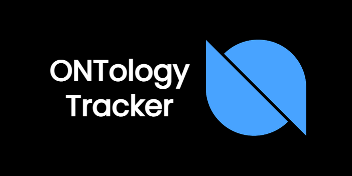
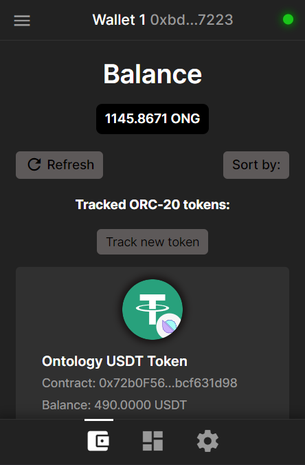
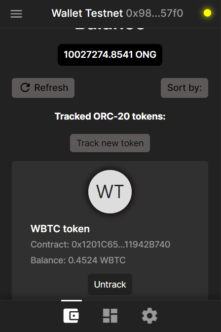
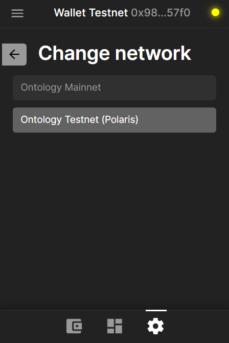

<div>
  <p align="center">
    
  <h3 align="center"><u>ONTology Token Tracker</u></h3>
  <p align="center">A Chrome browser extension for tracking balances of assets (ORC-20 & ORC-721) on Ontology Mainnet and Testnet</p>
</div>

--------

## Built using: 
- [Web3.js](https://web3js.readthedocs.io/en/v1.7.3/) library;
- Public RPCs of Ontology Mainnet and Testnet

---------

## Features:

- Ability to view / track / untrack ORC-20 tokens on Ontology Mainnet & Testnet;
- Ability to add new wallets to your address book and delete unnecessary ones;

----------

## How to use / How to install extension:

1. Download this repository (ZIP);
2. Unzip it;
3. Turn on **Developer mode** in the Chrome extension section and install extension:
    1. Go to ```chrome://extensions/``` and toggle the **Developer mode** in the top right.
    2. Click the **Load unpacked extension** button and select the unzipped folder of extension to install it.


----------

## Screens:

  <table>
  <tr>
    <td></td>
    <td></td>
    <td></td>
  </tr>
</table>


